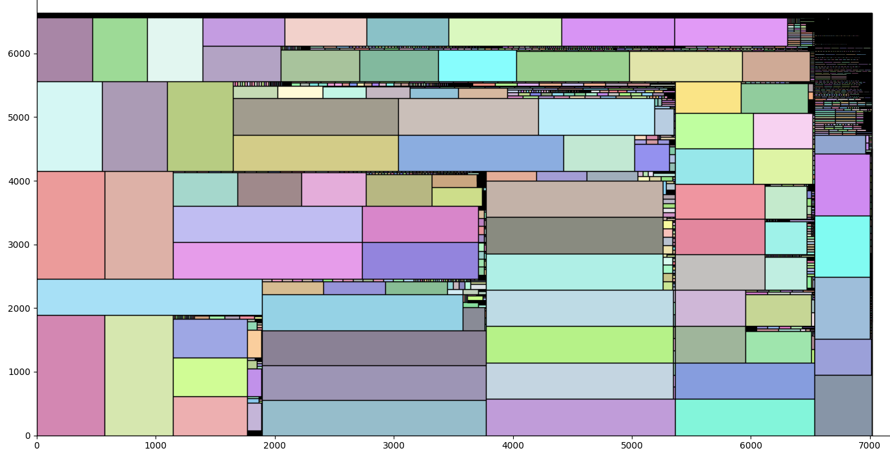
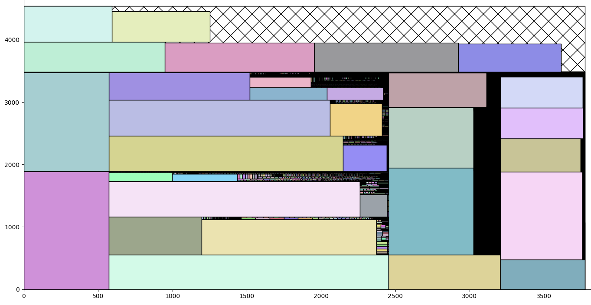

# Результаты работы алгоритма на тестовых примерах

Здесь приведены результаты тестирования алгоритмов на различных
датасетах, в том числе из литературы. 

## Maximum increment (MI) heuristic

### `zdf`

Результаты тестирования эвристики MI на датасете `zdf` приведены в
файле `zdf_area_result.txt`. При тестировании использовалась сортировка
элементов по площади.

Пример `zdf13`:

Пример `zdf16`:

### `instance`

Результаты тестирования эвристики MI на датасете `zdf` приведены в файлах:
- `instance_area_result.txt` для сортировки по площади
- `instance_diagonal_result.txt` для сортировки по диагонали
- `instance_length_result.txt` для сортировки по длине
- `instance_width_result.txt` для сортировки по ширине

### Формат

- номер примера (целое число)
- размеры контейнера (два целых числа, разделены пробелом)
- эффективность (число с точкой)
- время в секундах (число с точкой)
